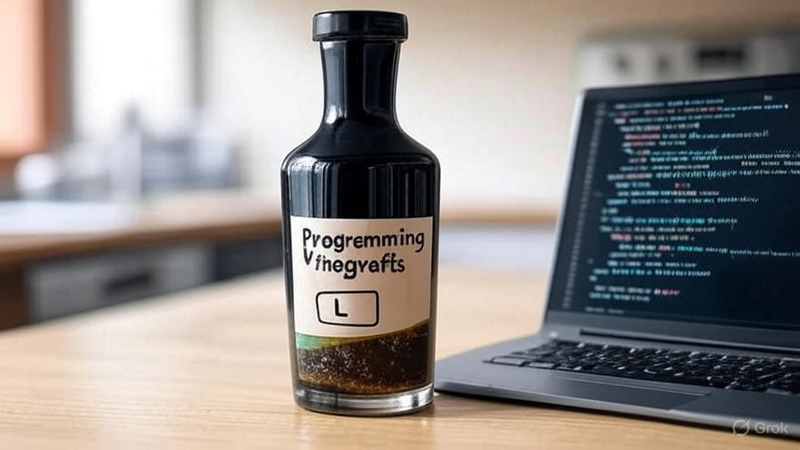

# CCM Vignettes

This is a small repository of our collection of vignettes that we have developed over the years that we are open sourcing for the general public. These vignettes come in different formats, shapes and sizes. Some of them are extensive analysis pipeline breakdowns (e.g. RNA-Seq) some are quick tips and code snippets to get you started (e.g. R data visualization) and others are code chunks to illustrate different aspects of popular packages or repositories. 

These vignettes are provided to help you get started on different topics and data modalities and are not by any means comprehensive. They are just quick introductions to different topics so at least you have a starting point. 

These documets are created at different times and have different sources of information. We have done our best to make sure that all the code snippets are functional in our testing environments but we cannot guarantee that they will remain so with different versions of programming languages and operating systems. Additionally, these are provided AS IS and are for instruction purposes only. They are not meant to be authorative sources of information, nor they are the state of the art, as they are just introductions to vast areas of research. 

We hope that you find these useful and if you have similar documentation, code snippets, slides or other material that you have used, created and found helpful please create a pull request and we will review it and add to the repository if it's suitable. 

Thank you and happy learning. 