# R Data Visualization with ggplot and other packages

These are the data visualization notes based on CCM Tutorials, we will be focusing on ggplo2 R package as this is a very
versatile package with a lot options and easy to use syntax. For setting up R and Rstudio please see the main README file

The plotting.R file also explores not only everything in this file but also has additional examples. 


## Install dependencies

These are the package we will be using. They are availbale throug CRAN.

```R
install.packages(c("ggplot2", "pheatmap", "dplyr", "patchwork", "viridis"))
```

If you want to use BiocManager you will need to install it first. 

```R
install.packages("BiocManages")

BiocManager::install(c("ggplot2", "pheatmap", "dplyr", "patchwork", "viridis"))
```

### Load the packages

```R
library(ggplot2)
library(patchwork)
library(pheatmap)
library(dplyr)
```

For most of our visualizations we will be using the diamonds dataset. This is a built in dataset that comes with R and you can 
easiyl load it. Later we will load our own tsv file and perform some viusalizations as well. 

```R
data(diamonds)
head(diamonds)
```

```
# A tibble: 6 × 10
  carat cut       color clarity depth table price     x     y     z
  <dbl> <ord>     <ord> <ord>   <dbl> <dbl> <int> <dbl> <dbl> <dbl>
1  0.23 Ideal     E     SI2      61.5    55   326  3.95  3.98  2.43
2  0.21 Premium   E     SI1      59.8    61   326  3.89  3.84  2.31
3  0.23 Good      E     VS1      56.9    65   327  4.05  4.07  2.31
4  0.29 Premium   I     VS2      62.4    58   334  4.2   4.23  2.63
5  0.31 Good      J     SI2      63.3    58   335  4.34  4.35  2.75
6  0.24 Very Good J     VVS2     62.8    57   336  3.94  3.96  2.48
```

## Plotting

ggplot objects can be used in 2 similar ways. You can initiate a ggplot object and keep adding (`+`) things to id
or you can start declaring your variables and then specify plots. There are uses for both and we will cover them. 

```R
# empty plot
ggplot()
```


This just creates an empty plot area. Since we did not specify our data or any kind of attributes it's just a blank space. 

```R
# add data
ggplot(data=diamonds)
```


This still does not display anything because we did not discuss what kinds of things we want to plot. We can add some
aesthetics so R at least knows what to do with the axes. 

```R
ggplot(data=diamonds, aes(x=carat, y=price))
```

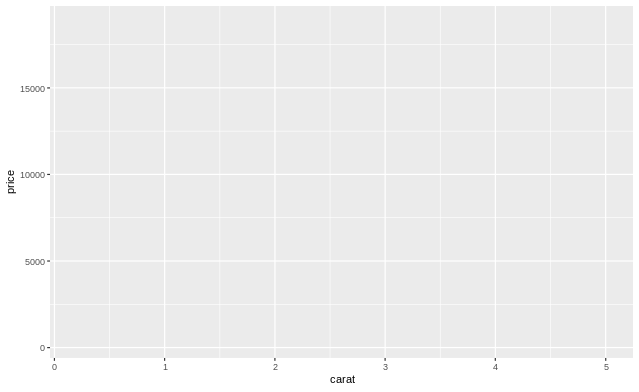

Ok, we can see the range our data takes but we still did not describe what kind of plot we want. Let's add that. For a quick
introduction to what kinds of plots you can plot see the data-visualization.pdf file. 

```R
ggplot(data=diamonds, aes(x=carat, y=price))+geom_point()
```

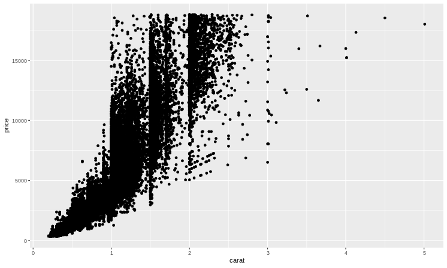


So we have a scatter plot of all the diamonds. This is not that helpful. I can see that bigger diamonds are more expensive but
there is a lot of variabliblity. 

Before we move on I mentioned that we can initialize a ggplot object and add things to it. This is quite easy to do, and when you
want to plot things on top of each other (see below) comes in quite handy. The below code will generate the same plot. 

```R
ggplot()+geom_point(data=diamonds, aes(x=carat, y=price))
```
We can add color/shape/transparency based on different attributes. 

```R
ggplot()+geom_point(data=diamonds, aes(x=carat, y=price, color=clarity))

```
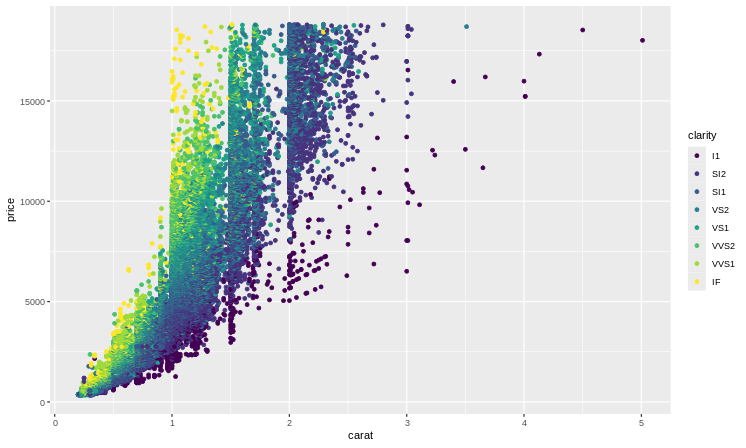

We can also change the shape of the dots based on a factor using shape argument. 

```R
ggplot()+geom_point(data=diamonds, aes(x=carat, y=price, color=clarity, shape=cut))
```

There is one gotcha, for the shape or lineytpe (see below) you cannot use continuous variables, they will have to have 
discrete values. For color there are color palettes that suppor continous and some that support discreete. For the latter
make sure that you have enough different colors. If you have 5 levels your palette should have at least 5 colors. 

## Other types of plots: 

We will quickly go over some of the most common ones. For illustration purposes I will also be adding some color or or shape
features along the way to show you some of the parameter w/o being exhausting and exhaustive. 

**Boxplot**

```R
# fill refers to the color inside the shape while color refers to the outline of the shape
ggplot(data=diamonds, aes(x=clarity, y=price, fill=cut))+geom_boxplot()
```
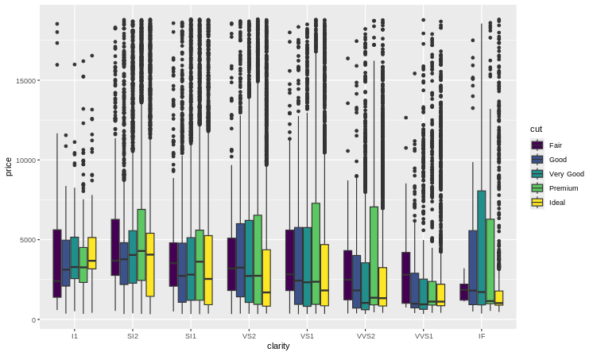

**Violin Plot**

```R
ggplot(data=diamonds, aes(x=clarity, y=price, fill=cut))+geom_violin()
```

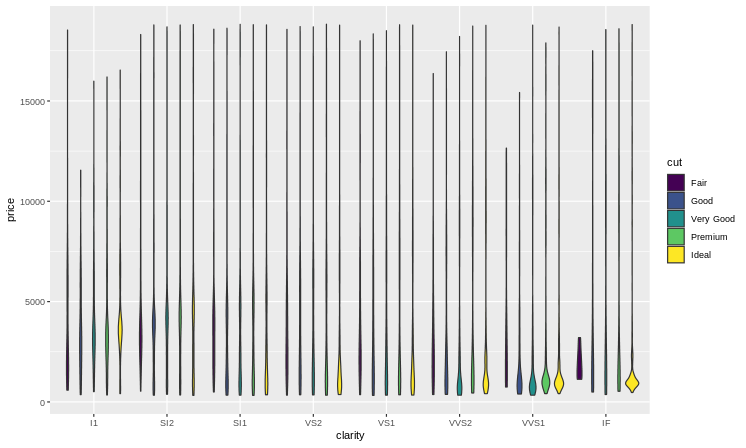

Off, this looks terrible, we can play with the axes a little bit, Seems like there are a lot of outliers, how about
we do not plot anything above 7500 (I can't afford them anyway). 

```R
# same works for xlim and you can do them separately
ggplot(data=diamonds, aes(x=clarity, y=price, fill=cut))+geom_violin()+ylim(0, 7500)
```
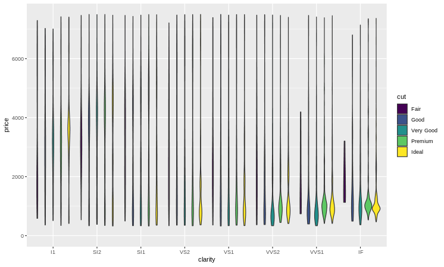

** Bar graphs ** 

While some plots have the actual numbers on the graph others want to give you the numbers of things in each category. 
You can create a new dataframe that captures these numbers and plot them (and sometimes you have to because you have a complex
number of steps), but if you are looking for simple things ggplot has your back. 

*the easy way*

```R
ggplot(data=diamonds, aes(x=cut))+geom_histogram(stat="count")
```

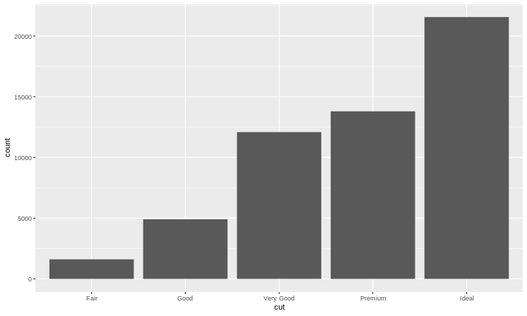

*the hard way*

```R
 diamonds_count<-diamonds %>%
  group_by(cut)%>%
  count()

ggplot(data=diamonds_count, aes(x=cut, y=n))+geom_bar(stat="identity")
```


You can add different things to your barplot, here stat and position comes into play. 

Let's cound the number of diamonds but cut *and* clarity. 


```R
diamonds_count2<-diamonds %>%
  group_by(cut, clarity)%>%
  count()

head(diamonds_count2)
```

```
# A tibble: 6 × 3
# Groups:   cut, clarity [6]
  cut   clarity     n
  <ord> <ord>   <int>
1 Fair  I1        210
2 Fair  SI2       466
3 Fair  SI1       408
4 Fair  VS2       261
5 Fair  VS1       170
6 Fair  VVS2       69
```


```R
ggplot(data=diamonds_count2, aes(x=cut, y=n, fill=clarity))+geom_bar(position="fill", stat = "identity")

```
Here the position argument tells us to fill it all the way to the top, this will give you the relative ratios of things but not the
number. If you want the stack *and* the number use `stack`. If you do not want to stack them but put them side by side use 
`dodge`

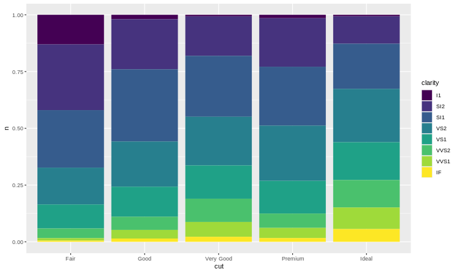

You can also see that we used `stat=identitiy` because we do not want ggplot to count things for us and we are telling it
to leave the numbers as is. 

Let's move from little expensive things to bigger expensive things. We will be using the mtcars dataset that describes
features of different cars. 

```R
data(mtcars)
head(mtcars)
```
```
                   mpg cyl disp  hp drat    wt  qsec vs am gear carb
Mazda RX4         21.0   6  160 110 3.90 2.620 16.46  0  1    4    4
Mazda RX4 Wag     21.0   6  160 110 3.90 2.875 17.02  0  1    4    4
Datsun 710        22.8   4  108  93 3.85 2.320 18.61  1  1    4    1
Hornet 4 Drive    21.4   6  258 110 3.08 3.215 19.44  1  0    3    1
Hornet Sportabout 18.7   8  360 175 3.15 3.440 17.02  0  0    3    2
Valiant           18.1   6  225 105 2.76 3.460 20.22  1  0    3    1
```

What if I want to know which car which property, and I want to labels on the plot. 

```R
ggplot(data=mtcars, aes(x=mpg, y=hp, label=rownames(mtcars)))+geom_text()

```

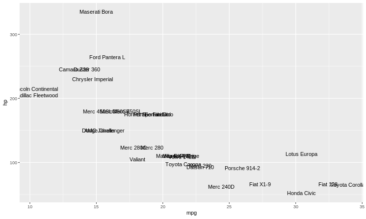

If you have a lot of labels things can get pretty messy really quickly. 

**Density Plots**

Simlar to violin plots you can use density plots to show the relationship between variables. 

```R
ggplot(diamonds, aes(x=price, color=cut))+geom_density()
```

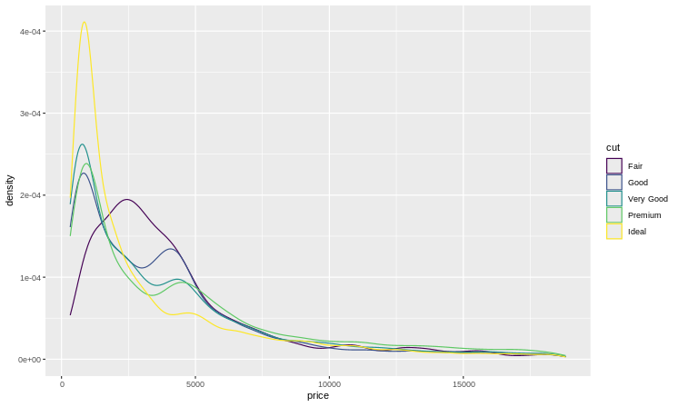

When you have a lot of large object in the plot maybe you want to introduce some transparency. Compare the two plots below

```R
ggplot(diamonds, aes(x=price, fill=cut))+geom_density()
ggplot(diamonds, aes(x=price, fill=cut))+geom_density(alpha=0.2)
```
alpha defines transparency. 0 fully tranparent 1 no transparancy. 

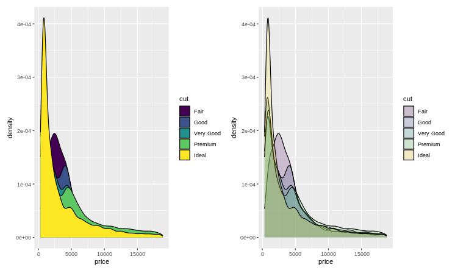

Don't worry about how I put the two plots side by side we will get to that later. BTW there is nothing stopping you 
from plotting 2 continous densities. 

```R
ggplot(data=diamonds, aes(x=depth, y=table, color=cut))+geom_density2d()
```

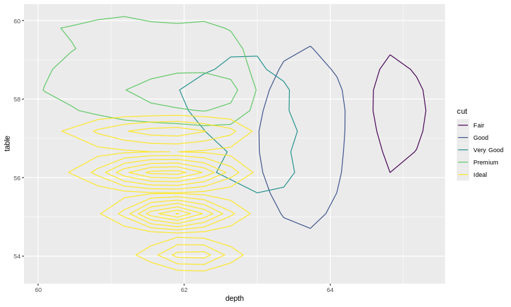

### Overlaying plots

Sometimes you want to plot 2 different kinds on top of each other. like a boxplot and then the actual points on top.

```R
# a little transparency 
ggplot(diamonds, aes(x=clarity, y=price))+geom_boxplot()+geom_point(alpha=0.05)
```

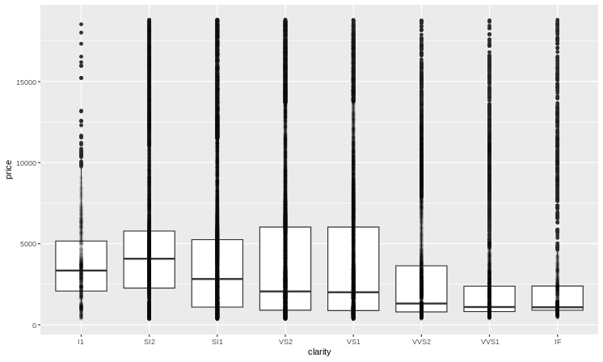

That was not what I have in ming. All my points are just on top of each other. I would like to spread them a little bit to 
cover the width of the boxplot. 

```R
ggplot(diamonds, aes(x=clarity, y=price))+geom_boxplot()+geom_jitter(alpha=0.05)
```
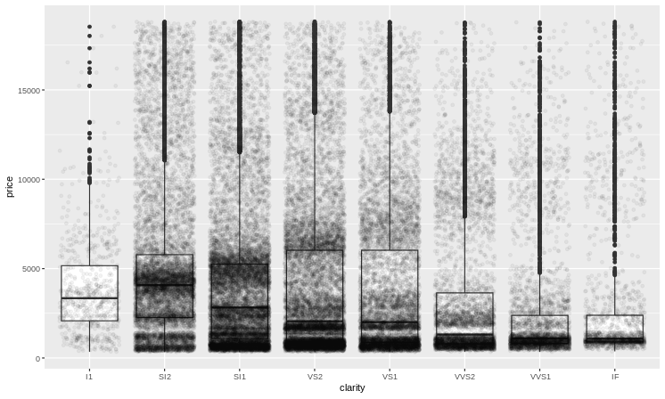

You can adjust the width with the `width` option. 

We talked about `position=dodge` but that is not special for a boxplot you can use it for other kinds too. 

```R
ggplot(diamonds, aes(x=clarity, y=price, color=cut))+geom_point(position = position_jitterdodge())
```
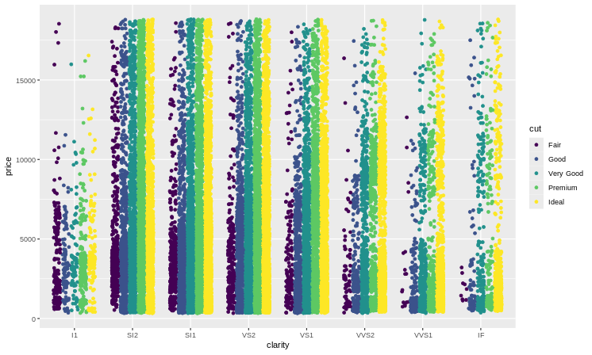


There are some fancy (and a little over the top) examples of these ideas in the `plotting.R` file. 

## Modifying the plot

So far we used our column names and ranges as is. Sometimes you want to add things to the plot like a title, or 
change axis labels or move the legend. As we said you can just keep adding things to your plot whether they are
additional plots or modifications to the original plot. Here is a kitchen sink: 

```R
ggplot(diamonds, aes(x=clarity, y=price, fill=cut))+geom_boxplot()+ggtitle("Awesome diamonds")+ 
  ylab("Price of diamonds in USD ($)")+xlab("Clarity of the diamond")+
  theme(legend.position = "bottom")+scale_y_log10()+coord_flip()

```

We added at title, chaged axis labels, changed y axis to log10 and flipped the coordinates (x<->y). 

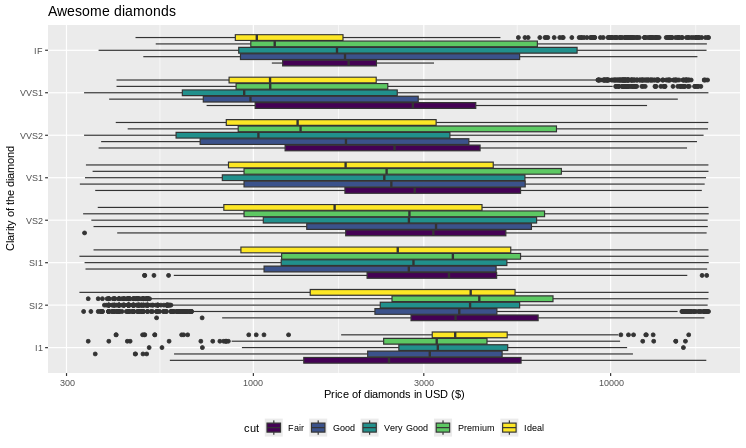

## Changing themes, color palettes etc. 

There are a few built in palettes that you can use out of the box. They are described [here](http://www.cookbook-r.com/Graphs/Colors_(ggplot2)/)

```R
ggplot(diamonds, aes(x=clarity, y=price, fill=cut))+geom_boxplot()+ggtitle("Awesome diamonds")+
  ylab("Price of diamonds in USD ($)")+xlab("Clarity of the diamond")+
  theme(legend.position = "bottom")+scale_fill_brewer(palette = "Set1")
```

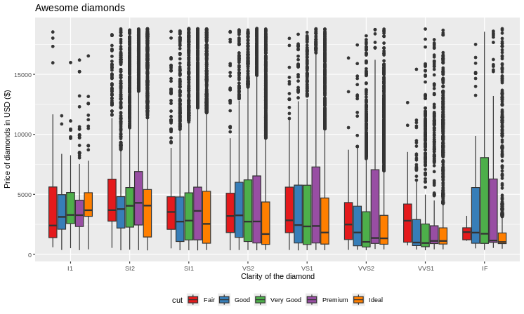

You can also specify your own:

```R
ggplot(diamonds, aes(x=clarity, y=price, fill=cut))+geom_boxplot()+ggtitle("Awesome diamonds")+
  ylab("Price of diamonds in USD ($)")+xlab("Clarity of the diamond")+
  theme(legend.position = "bottom")+scale_fill_manual(values=c("red", "blue", "green", "black", "orange"))
```

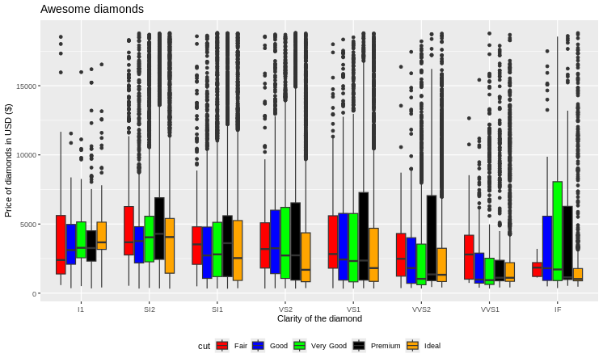

Same idea with continous variables, but this time you only define 2 (or 3 ) colors and R takes care of the rest. 

```R
ggplot(diamonds, aes(x=clarity, y=carat, color=price))+geom_jitter()+
  scale_color_gradient2(low="navy", mid="white", high = "red", midpoint = mean(diamonds$price))
```

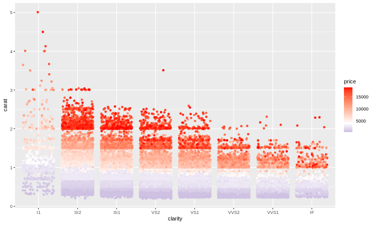

**Side Note**: all of these function comes in many flavors and are named with a somewhat standard convention. They
start with scale_[kind that you are specifiny color to]_[type_of_change]. 

So `scale_color_gradient`, modifies color with a gradient of 2 colors (gradient2 takes a midpoint). `scale_fill_manual`
changes the fill attribute with manual colors. 

## Are my eyes decieving me?

Yes, not all color palettes are created equal, in some instances our eyes are biased towards different colors (like greens 
usually appear brighter than red for equal values of luminosity). Some do not convey a linear gradient of change, or are not
colorbling friendly or look terrible when printed in black and white. The virids color palettes are desinged to alleviate
(not completely solve) some of these problems. See [here](ttps://cran.r-project.org/web/packages/viridis/vignettes/intro-to-viridis.html)
for more information. 

```R
library(viridis)

ggplot(diamonds, aes(x=clarity, y=carat, color=price))+geom_jitter()+
  scale_color_viridis_c(option="G") #there are 8 options

```

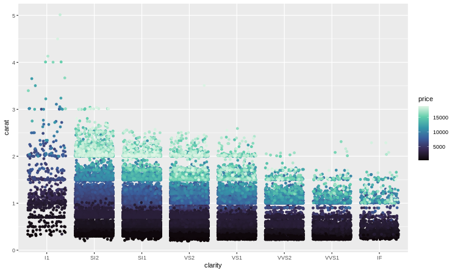

There are also themes, see plotting.R for examples. 

### Adding shapes

Sometimes, you want add a line or a rectangle or some other thing to draw attention to a region. Here are some examples. 


**adding lines**
```R
ggplot(diamonds, aes(x=carat, y=price))+geom_point()+
  geom_hline(yintercept = c(5000, 10000), color="red", linetype="dashed")
ggplot(diamonds, aes(x=carat, y=price))+geom_point()+
  geom_hline(yintercept = c(5000, 10000), color="red", linetype="dashed")+
  geom_vline(xintercept = c(1,2), color="blue", linetype="dotdash")
```
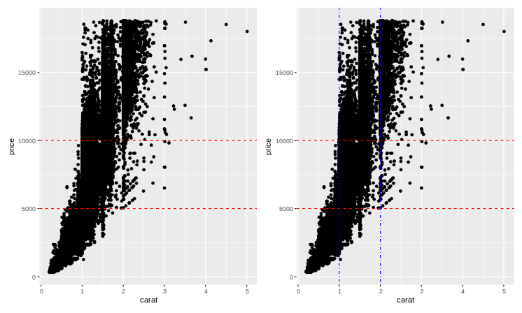


**add a rectangle, add a specific line**
```R
ggplot(diamonds, aes(x=carat, y=price))+geom_point()+
  geom_rect(xmin=1, xmax=2, ymin=5000, ymax=10000, alpha=0.05, color="goldenrod", fill="goldenrod")


# add a specific line to the plot
ggplot(diamonds, aes(x=carat, y=price))+geom_point()+geom_abline(slope = 400, intercept = 0)
```

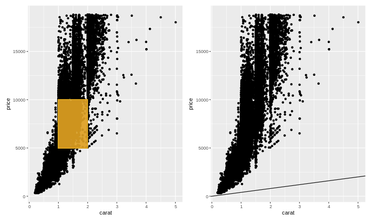

**add a linear regression model for the whole dataset, per feature**

```R
ggplot(diamonds, aes(x=carat, y=price))+geom_point()+geom_smooth(method="lm")
ggplot(diamonds, aes(x=carat, y=price, color=clarity))+geom_point()+geom_smooth(method="lm")
```


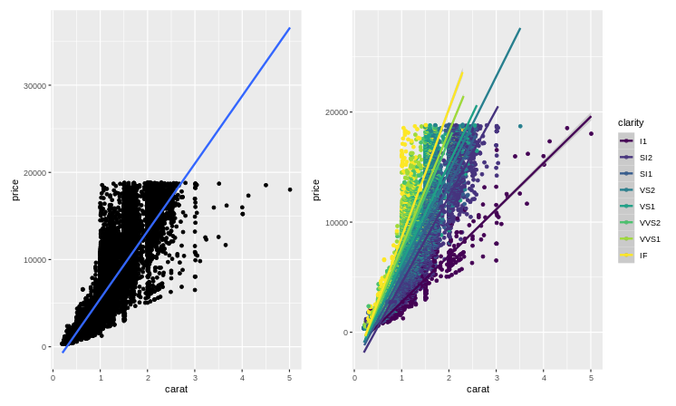

### Facets

Sometimes, you want to plot the same kind of plot but separate your data to individual pieces, you can do this manually
if it's really a complicated splitting, but if you just want to plot a new plot per **discreet** values of a column ggplot 
can do that for you out of the box. 

`facet_wrap` as the name suggest just plots a new plot and puts them side by side, you can determine how many columns (or row)
you want with `ncol` or `nrow`. 

```R
ggplot(diamonds, aes(x=carat, y=price, color=cut))+geom_point()+facet_wrap(.~clarity, ncol=5)
```

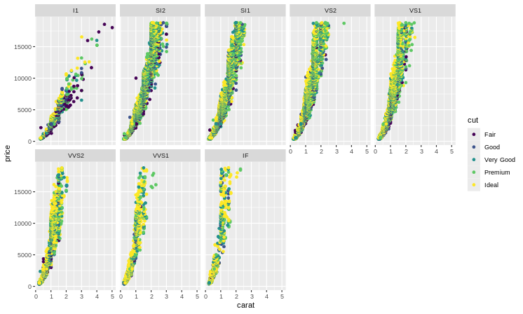

This is a simple "wrap", if you want a more robust application you may want to use `facet_grid`

```R
ggplot(diamonds, aes(x=carat, y=price, color=clarity))+geom_point()+facet_grid(color~cut)
```

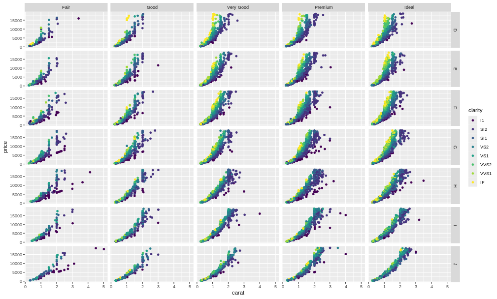

## Putting different plots together

In some examples I have placed 2 plots side by side, here's how I did it. See patchwork [documentation](https://patchwork.data-imaginist.com/index.html) for more details.


```R
library(patchwork)
plot1<-ggplot(diamonds, aes(x=cut, y=price, color=color))+geom_boxplot()
plot2<-ggplot(diamonds, aes(x=color, y=price, color=clarity))+geom_boxplot()

plot1+plot2 #side by side
#plot1/plot2 # on top of each other
```

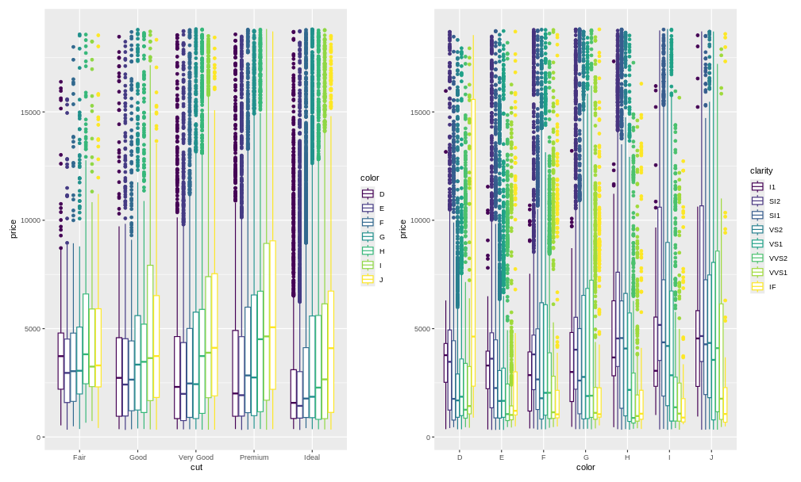

You can generate each plot separately to your liking and then compbine them as you see fit. See plotting.R for more examples. 


## Heatmaps

These are the workhorse of biological data visualizations. They are so dense and contain so much information. Fortunately, 
most of the time they are not too terrible to generate. We will use the `pheatmap` library. P stands for pretty. 

```R
library(pheatmap)

expression_data<-read.table("r-sample-data.txt", header = T, sep = "\t")
# you need a numerical matrix for pheatmap, dataframes will not do
expression_matrix<-as.matrix(expression_data[, -c(1,2)])
rownames(expression_matrix)<-expression_data$Probe # add rownames
head(expression_matrix[, 1:4]) #first 6 rows via head and first 4 columns by indexing
```
```
                 c151       c152       c153       c155
cg17409393 0.07188735 0.07911427 0.07518386 0.05513525
cg18077307 0.53111430 0.53564580 0.61424100 0.48389070
cg00602811 0.43692570 0.44160440 0.45255740 0.33788730
cg23855901 0.79894520 0.85738630 0.81045620 0.80207340
cg05558330 0.82139340 0.83046440 0.81761750 0.84846740
cg05374025 0.36911690 0.61183080 0.45144100 0.35334690
```

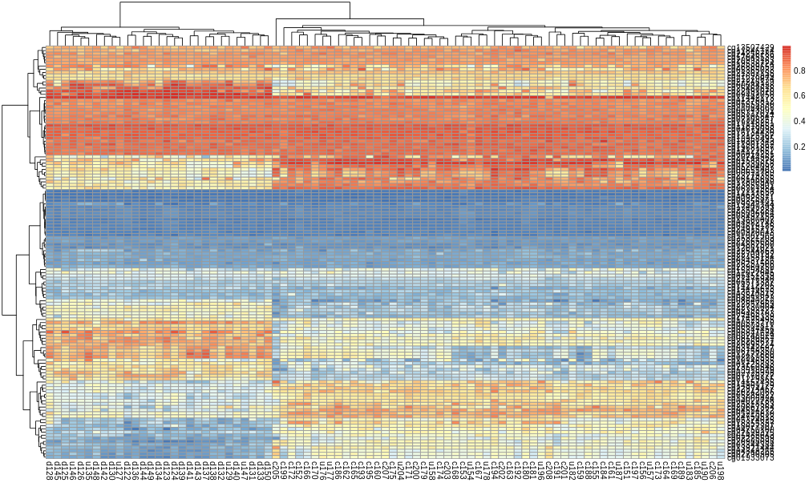

That wasn't too bad. See plotting R for how to changes colors and other features. This is not good enough though. We want to 
add some annotations.

```R
annotation_col<-data.frame(treatment_group=case_when(grepl("c", colnames(expression_data[, -c(1,2)])) ~ "control", 
                                           grepl("d", colnames(expression_data[, -c(1,2)])) ~ "group1", 
                                           grepl("u", colnames(expression_data[, -c(1,2)])) ~ "group2"), 
                           genotype=ifelse(as.integer(gsub("[a-z]", "", colnames(expression_data[, -c(1,2)]))) %% 2 ==0, "KO", "WT")
)
rownames(annotation_col)<-colnames(expression_data[, -c(1,2)])

annotation_col
```
```
# each row corresponds to a sample and the row names must match. 
     treatment_group genotype
c151         control       WT
c152         control       KO
c153         control       WT
c155         control       WT
c156         control       KO
c159         control       WT
```

```R
pheatmap(expression_matrix, fontsize_row = 8, fontsize_col = 8, show_rownames = T, 
         color = colorRampPalette(  c('navy', 'white', 'firebrick4'))(100), 
         treeheight_row = 0, annotation_col = annotation_col, clustering_distance_cols = "euclidean", 
         clustering_distance_rows = "manhattan")
```


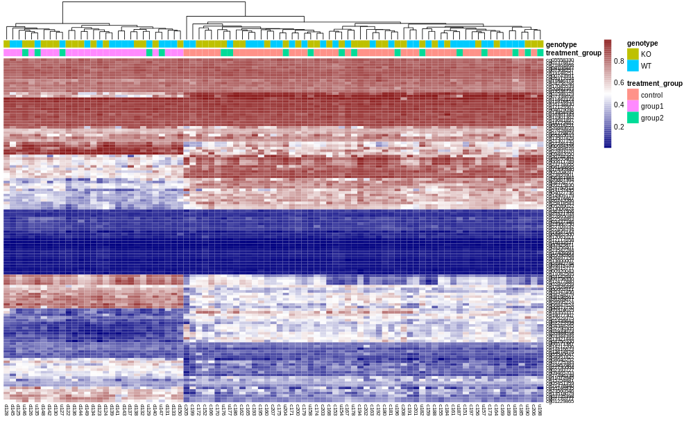

Much better. 

That's all folks, See plotting.R for how more details and how to generate plots programmaticall and save them to a pdf. 